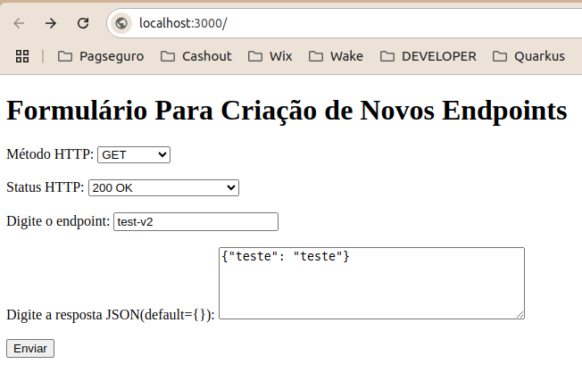

# Endpoint Genie

## Descrição do Projeto
Projeto que viabiliza o teste de uma ou mais aplicações que possuem dependências de endpoints externos e é necessário realizar validações locais.

## Funcionalidades e Demonstração da Aplicação
Aplicação em NodeJS que sobe um endpoint com a função de criar outros endpoints ao fornecer method, url, response body(em Json) e HTTP respose Code que será retonado ao chamar o mesmo.

**Intalações necessárias:**
- Docker
  
Para executar o projeto devemos executar via terminal o comando ``docker-compose up``.

**Para registrar novos endpoints:**

  - Acesse: *http://localhost:3000/*; 
  

  - Ou, através de postman realizar a chamada via post *http://localhost:3000/set-endpoint*
  Exemplo do Json do body necessário:

  ```
  {
    "method": "POST",
    "endpoint": "v1/users",
    "json": {
      "name": "John Doe",
      "email": "johndoe@example.com"},
    "status": 201
  }
  ```
  No exemplo acima será criado um endpoint POST *http://localhost:3000/v1/users* que vai retornar um json com nome e email com status code 201.

Toda vez que criamos um endpoint ele salva a requisição em um arquivo chamado endpoints.txt e quando a aplicação é reiniciada ela sobe os endpoints já salvos.

Na necessidade de alterar ou apagar um endpoint, podemos manipular diretamente através do arquivo endpoints.txt ou, caso queira removê-lo apenas da execução, utilizar o endpoint: *http://localhost:3000/delete-endpoint/id* informando o id do endpoint a ser removido.
